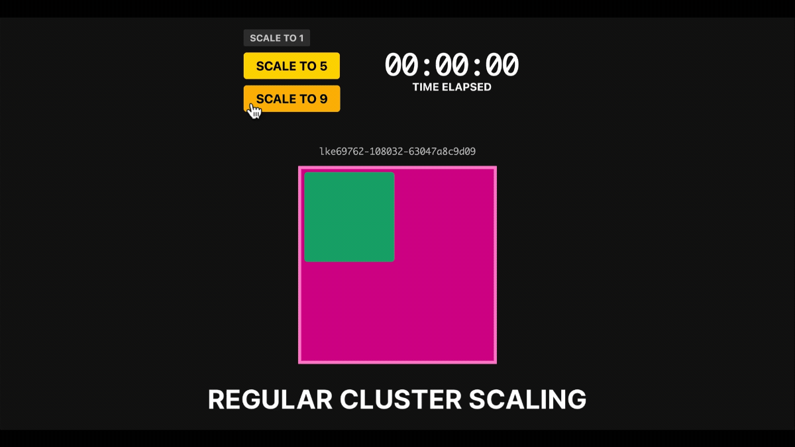

# Proactive cluster autoscaling in Kubernetes

This project helps you create a cluster with idle nodes ready to deploy new workloads.



## Getting started

You need to create a Linode token to access the API:

```bash
linode-cli profile token-create
export LINODE_TOKEN=<insert the token here>
```

```bash
# Create the cluster
terraform -chdir=01-clusters init
terraform -chdir=01-clusters apply -auto-approve

# Label the node, install KEDA + Prometheus
terraform -chdir=02-setup init
terraform -chdir=02-setup apply -auto-approve

# Scale to 3 nodes
linode-cli lke pool-update <cluster id> <pool id> --count 3 # cluster 1
linode-cli lke pool-update <cluster id> <pool id> --count 3 # cluster 2

# Cleanup
terraform -chdir=02-setup destroy -auto-approve
terraform -chdir=01-clusters destroy -auto-approve
```

_Why scale to 3 nodes after the first step?_

This is to ensure that all LKE's controllers end up in the same node, and you can uniquely tag that node.

## Demo the overprovisioning

Make sure that your kubectl is configured with the current kubeconfig file:

```bash
export KUBECONFIG="${PWD}/kubeconfig"
```

Then execute:

```bash
kubectl apply -f 03-demo-simple/01-podinfo.yaml
```

When ready, observe the node scaling up with:

```bash
kubectl scale deployment/podinfo --replicas=5
```

[**Or use the dashboard.**](#dashboard)

The total scaling time for the 5th pod should take ~2m.

Scale back to 1 and submit the placeholder pod with:

```bash
kubectl scale deployment/podinfo --replicas=1
kubectl apply -f 03-demo-simple/02-placeholder.yaml
```

Repeat the experiment. The total scaling time should go down to ~10s.

## Dashboard

```bash
kubectl proxy --www=./dashboard --www-prefix=/static &
open http://localhost:8001/static
```

## HPA demo

Make sure that your kubectl is configured with the current kubeconfig file:

```bash
export KUBECONFIG="${PWD}/kubeconfig-hpa"
```

Then execute:

```bash
kubectl apply -f 04-demo-hpa/01-rate-limiter.yaml
kubectl apply -f 04-demo-hpa/03-scaled-object.yaml
```

At this point, you should have at least two nodes. One has four podinfo pods.

Scale your workers to three instances so that you have an empty node.

Retrieve the IP address of the load balancer for Locust with:

```bash
kubectl get service locust -o jsonpath='{.status.loadBalancer.ingress[0].ip}'
```

Drive traffic to the instance:

- Number of users: 300
- Concurrent users: 0.4
- Url: `http://podinfo`

Repeat the experiment.

```bash
kubectl delete -f 04-demo-hpa/03-scaled-object.yaml
kubectl scale deployment/podinfo --replicas=1
```

Wait for the Cluster autoscaler to drain the nodes. By the end, you should have only 2.

Submit the placeholder pod:

```bash
kubectl apply -f 04-demo-hpa/placeholder.yaml
```

The pod stays Pending until the cluster autoscaler creates the third node.

Open Locust and drive the traffic to the deployment with:

- Number of users: 300
- Concurrent users: 0.4
- Url: `http://podinfo`

## Building the rate limiter

```bash
cd app
docker build -t learnk8s/rate-limiter:1.0.0 .
docker push learnk8s/rate-limiter:1.0.0
```
